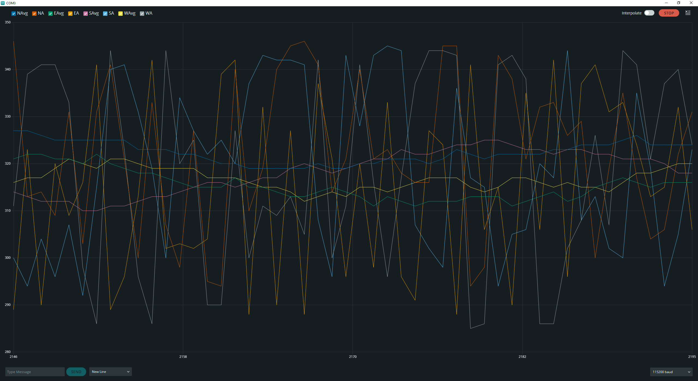

# FreeTarget Minimal
Markus Stöckli has done an excellent POC to run a FreeTarget with regular KY 037 sound sensors. See [https://github.com/stoeckli/freETarget]

Here is my journey to replicate his success:
# Initial Run 14.01.2024
First success: 🙂
- Did the Markus' magic bridging of the pins PD4-7 and PE5-7 by soldering them
- Created a 3d frame and printed it.
- Attached the sensors to the frame
- Connected the sensors to the Arduino
- Uploaded Markus' code to the Arduino.
- Had to send a version number and a '!' over the serial line from the Arduino IDE to exit the infinite loop of factory_nonvol().
- Ran the FreeTarget Client
Now the shots are off, but will look into this next weekend.
To calibrate the sound sensors KY 037 I have opened the potentiometer until the light right turned off, then I turned it back in for one full turn (clock wise).
Things to verify:
- Check if the length of the wires are problematic (N and S are double the length of the other two).
- Check how to initialize the Arduino forcefully (probably somewhere in the manual)
Next steps onece above runs:
- create better frame with arduino holder
- see if a simple standard arduino shield could clean up the Dupont wire wiring
- add witness paper (see https://github.com/milansismanovic/FreETarget)
- add LED
- add Bluetooth
- add mobile client for Bluetooth
Let me know if you are interested in the 3d frame and what you tink. 🙂

# Second Try 21.01.2024
## Issues observed 21.01.2024
- running Freetarget all shots get registered - however one of them has a zero timer value - either North or East
- North or East have both double the length of the cable
## Log of actions
- Tried changing the trigger voltage from 2.5V to 2.8V to 3.2V. - same results
- calibrated all sensor to show the same voltage on the analog pin (see little calibration Arduino program below)
## Next tries 
- add cables to match to W and S to match N and E
- find a way to verify the that the interrupts trigger with the expected micros() (Does the FreeTarget client have something of this sort?)
## test report 
### Recorded Shots

```
"shot":0, "miss":0, "name":"TARGET", "time":50.06 ,"x":6.52, "y":26.29 , "N":282, "E":0, "S":1535,"W":2112 , "V_REF":1.35, , "T":22.40, , "VERSION":"4.2.8 December 20, 2023"  ---- Computed shot X:-0.38 Y:24.09 R:24.093 A:90.9041850537363
"shot":1, "miss":0, "name":"TARGET", "time":76.60 ,"x":-2.23, "y":26.74 , "N":0, "E":301, "S":1864, "W":1873 , "V_REF":1.61, , "T":22.40, , "VERSION":"4.2.8 December 20, 2023"  ---- Computed shot X:-9.13 Y:24.54 R:26.18336 A:110.407480222312
"shot":2, "miss":0, "name":"TARGET", "time":120.74 ,"x":1.19, "y":29.98 , "N":0, "E":63, "S":1840, "W":2063 , "V_REF":1.55, , "T":22.40, , "VERSION":"4.2.8 December 20, 2023"  ---- Computed shot X:-5.71 Y:27.78 R:28.36076 A:101.615046503699
"shot":3, "miss":0, "name":"TARGET", "time":135.34 ,"x":6.06, "y":27.15 , "N":242, "E":0, "S":1578, "W":2135 , "V_REF":1.55, , "T":22.40, , "VERSION":"4.2.8 December 20, 2023"  ---- Computed shot X:-0.84 Y:24.95 R:24.96414 A:91.9285217068798
"shot":4, "miss":0, "name":"TARGET","time":163.61 ,"x":13.50, "y":23.67 , "N":762, "E":0, "S":1402, "W":2407 , "V_REF":1.19, , "T":22.40, , "VERSION":"4.2.8 December 20, 2023"  ---- Computed shot X:6.6 Y:21.47 R:22.46154 A:72.9122966630866
"shot":5, "miss":0, "name":"TARGET", "time":179.25 ,"x":6.86, "y":24.36 , "N":334, "E":0, "S":1447, "W":2015 , "V_REF":1.90, , "T":22.40, , "VERSION":"4.2.8 December 20, 2023"  ---- Computed shot X:-0.04 Y:22.16 R:22.16004 A:90.1088635321615
"shot":6, "miss":0, "name":"TARGET", "time":193.79 ,"x":9.33, "y":27.94 , "N":501, "E":0, "S":1672, "W":2401 , "V_REF":1.51, , "T":22.40, , "VERSION":"4.2.8 December 20, 2023"  ---- Computed shot X:2.43 Y:25.74 R:25.85445 A:84.6069032063379
```  

### FreeTarget Log
```
freETarget "4.2.8 December 20, 2
023"

0.001368: init_gpio()
0.002316: init_sensors()
0.004492: init_analog_io()
0.004956: init_timer()
0.006828: read_nonvol()
0.009664: POST_counters()
0.012236: 
Failed Clock Test. Spurious trigger: Latch:NESW  Face Strike:0  V_Ref:1.46  Temperature:22.40  WiFi:0  Switch:-- --
0.022180: 
0.023224: Starting timers
0.025548: esp01_init()
0.027576: esp01: Resetting esp01
3.0458
60: esp01: Failed to reset esp01
6.062092: esp01: Not Found
7.064348: POST LEDs
7.814932: Cleari
ng serial buffers
7.815612: Finished startup
{
"NAME":"TARGET", 
"ANGLE": 45, 
"CALIBREx1
0": 45, 
"DIP": 0, 
"DOPPLER": 50.000000, 
"F
ACE_STRIKE": 0, 
"FOLLOW_THROUGH": 0, 
"KEEP_A
LIVE": 120, 
"LED_BRIGHT": 50, 
"MFS": 20351,
"MFS2": 0, 
"MIN_RING_TIME": 500, 
"NAME_ID":
0, 
"NEW": 0, 
"PAPER_ECO": 0, 
"PAPER_TIME"
: 50, 
"POWER_SAVE": 30, 
"RAPID_COUNT": 0, 
"RAPID_ENABLE": 0, 
"RAPID_TIME": 0, 
"RAPID_W
AIT": 0, 
"RH": 50, 
"SEND_MISS": 0, 
"SENSOR
": 230.000000, 
"SN": 192, 
"STEP_COUNT": 0,
"STEP_TIME": 0, 
"TABATA_ENABLE": 0, 
"TABATA_
ON": 0, 
"TABATA_REST": 0, 
"TABATA_WARN_OFF":
0, 
"TABATA_WARN_ON": 200, 
"TARGET_TYPE": 0,
"TOKEN": 0, 
"WIFI_CHANNEL": 6, 
"WIFI_PWD"
: "", 
"WIFI_SSID": "", 
"Z_OFFSET": 13, 
"NORTH_X": 0, 
"NORTH_Y": 0, 
"EAST_X": 0, 
"EAS
T_Y": 0, 
"SOUTH_X": 0, 
"SOUTH_Y": 0, 
"WEST
_X": 0, 
"WEST_Y": 0, 
"TA": 0, 
"TB": 0, 
"TC": 0, 
"TD": 0, 

"MFS_TAP1": "PAPER_SHOT",
"MFS_TAP2": "WAKE_UP",
"MFS_HOLD1": "PAPER_FEE
D",
"MFS_HOLD2": "POWER_ON_OFF",
"MFS_HOLD12":
"ADJUST_LED",
"MFS_CONFIG": "DEFAULT",
"MFS_DIAG": "D
EFAULT",
"TRACE": 0, 
"RUNNING_MINUTES": 0,
"TEMPERATURE": 22.40, 
"SPEED_SOUN
D": 0.345392, 
"V_REF": 1.44, 
"V_12_LED": 9.2
2, 
"VSET_PWM": 0, 
"TIMER_COUNT": 11136, 
"W
iFi_PRESENT": 0, 
"VERSION": "4.2.8 December 20, 2023", 
"PS_VERSION": 16, 
"BD_REV": 3.00
}
DLT CRITICAL

Settings
0x01 DL
T APPLICATON
0x02 DLT DIAG
0x04 DLT INFO
0x89 DLT CRITICAL
DLT C
RITICAL
DLT APPLICATON

Settings
0x01 DLT APP
LICATON
0x02 DLT DIAG
0x04 DLT INFO
0x89 DLT
CRITICAL
50.36024
5: Loop State: AQUIRE
50.360775: init_sensors()
50.387222: Reducing shot: 0
Location: 0
50.387951: Follow through: 0
{"s
hot":0, "miss":0, "name":"TARGET", "time":50.06 ,
"x":6.52, "y":26.29 , "N":282, "E":0, "S":1535,
"W":2112 , "V_REF":1.35, , "T":22.40, , "VERSION":"4.2.8 December 20, 2023" }
50.459240: Loop State: REDUCE
50.459843: Loop State: SET_MODE
50.460556: Loop State: ARM
50.461826: Waiting...
50.463863: Loop State: WAIT
77.109810: Lo
op State: AQUIRE
77.110352: init_sensors()
77.136719: Reducing shot: 1
Loca
tion: 0
77.137459: Follow through: 0
{"shot":1
, "miss":0, "name":"TARGET", "time":76.60 ,"x":-
2.23, "y":26.74 , "N":0, "E":301, "S":1864, "W":1873 , "V_REF":1.61, , "T":22.40, , "VERSION":"4
.2.8 December 20, 2023" }
77.208740: Loop State: REDUCE
77.209343: Loop State: SET_MODE
77.210045: Loop State: ARM
77.211327: Waiting...
77.213364: Loop State: WAIT
121.609790: Loo
p State: AQUIRE
121.610340: init_sensors()
121.633000: Reducing shot: 2
Location: 0
121.633710: Follow through: 0
{"sho
t":2, "miss":0, "name":"TARGET", "time":120.74 ,"x":1.19, "y":29.98 , "N":0, "E":63, "S":1840, "W":2063 , "V_REF":1.55, , "T":22.40, , "VERSION"
:"4.2.8 December 20, 2023" }
121.705740: Loop State: REDUCE
121.706350: Loop State: SET_MODE
121.707070: Loop State: ARM
121.708600: Waiting...
121.710740: Loop State: WAIT
136.326520: Loop State: AQUIRE
136.3270
70: init_sensors()
136.353530:
Reducing shot: 3
Location: 0
136.354290: Follow through: 0
{"shot":3, "miss":0, "name":"TARGET", "time":135.34 ,"x":6.06, "y":27.15 , "N":242, "E":0, "S":1578, "W":2135 , "V_REF":1.55, , "
T":22.40, , "VERSION":"4.2.8 December 20, 2023" }
136.426500: Loop State: REDUCE
136.427110: Loop State: SET_MODE
136.427840: Loop State: ARM
136.429340: Waiting...
136.431500: Loop State: WAIT
164.827120: Loop State: AQUIRE
164.827670:
init_sensors()
164.858180: Red
ucing shot: 4
Location: 0
164.858920: Follow through: 0
{"shot":4, "miss":0, "name":"TARGET",
"time":163.61 ,"x":13.50, "y":23.67 , "N":762, "E":0, "S":1402, "W":2407 , "V_REF":1.19, , "T":22.40, , "VERSION":"4.2.8 December 20, 2023" }
164.931050: Loop State: REDUCE
164.931640: Loop State: SET_MODE
164.932370: Loop State: ARM
164.933870: Waiting...
164.936040: Loop State: WAIT
180.59213
0: Loop State: AQUIRE
180.592670: init_sensors()
180.619130: Reducing shot: 5
Location: 0
180.619870: Follow through: 0
{"shot":5, "miss":0, "name":"TARGET", "time":179.2
5 ,"x":6.86, "y":24.36 , "N":334, "E":0, "S":1447, "W":2015 , "V_REF":1.90, , "T":22.40, , "VERSI
ON":"4.2.8 December 20, 2023" }
180.692080: Loop State: REDUCE
180.692690: Loop State: SET_MODE
180.693410: Loop State: ARM
180.694930: Waiting...
180.697070: Loop State: WAIT
1
95.246230: Loop State: AQUIRE
195.246770: init_sensors()
195.277530: Reduci
ng shot: 6
Location: 0
195.278240: Follow through: 0
{"shot":6, "miss":0, "name":"TARGET", "t
ime":193.79 ,"x":9.33, "y":27.94 , "N":501, "E":0, "S":1672, "W":2401 , "V_REF":1.51, , "T":22.4
0, , "VERSION":"4.2.8 December 20, 2023" }
195.350200: Loop State: REDUCE
195.350810: Loop State: SET_MODE
195.351520: Loop State: ARM
195.353040: Waiting...
195.355190: Loop State: WAIT
309.202730: Loop State: AQUIR
E
309.203280: init_sensors()
309.210510: Reducing shot: 7
Loca
tion: 0
309.211240: Follow through: 0
{"shot":7, "miss":0, "name":"TARGET", "time":306.84 ,"x":NAN, "y":NAN , "N":0, "E":11026, "S":12865, "W"
:7319 , "V_REF":1.55, , "T":22.40, , "VERSION":"4.2.8 December 20, 2023" }
309.
282590: Loop State: REDUCE
309.283200: Loop State: SET_MODE
309.283940: Loop State: ARM
309.2
85430: Waiting...
309.287600: Loop State: WAIT
322.327670:
Loop State: AQUIRE
322.328220: init_sensors()
322.335420: Reducing shot: 8
Location: 0
322.336180: Follow through: 0
{"shot":8, "miss":0, "name":"TARGET", "
time":319.86 ,"x":NAN, "y":NAN , "N":0, "E":5555, "S":12321, "W":10734 , "V_REF":1.63, , "T":22.40, , "VERSION":"4.2.8 December 20, 2023" }
322.407560: Loop State: REDUCE
322
.408170: Loop State: SET_MODE
322.408870: Loop State: ARM
322.410400: Waiting...
322.412540: Loop State: WAIT
360.817900: Loop St
ate: AQUIRE
360.818420: init_sensors()
360.825560: Reducing shot: 9
Location: 0
360.826290: Follow through: 0
{"shot":9, "miss":0, "name":"TARGET", "time":35
8.04 ,"x":NAN, "y":NAN , "N":15683, "E":21238, "S":28004, "W":0 , "V_REF":1.52, , "T":22.40, , "VERSION":"4.2.8 December 20, 2023" }
360.898680: Loop State: REDUCE
360.899320: Loop State: SET_MODE
360.900020: Loop State: ARM
360.901580: Waiting...
360.903720: Loop State: WAIT
363
.621490: Loop State: AQUIRE
363.622040: init_sensors()
363.629180: Reducing shot: 10
Location: 0
363.629970: Follow through: 0
{"shot":10, "miss":0, "name":"
TARGET", "time":360.82 ,"x":NAN, "y":NAN , "N":-10527, "E":-16070, "S":-26387, "W":0 , "V_REF":1.50, , "T":22.40, , "VERSION":"4.2.8 December 20, 2023" }
363.702390: Lo
op State: REDUCE
363.703000: Loop State: SET_MODE
363.703700: Loop State: ARM
363.705260: Waiting...
363.707400: Loop State: WAIT
364.259000:
Loop State: AQUIRE
364.259550: init_sensors()
364.266600: Reducing shot: 11
Location: 0
364.267400: Follow through: 0
{"shot":11, "miss":0, "name":"TARGET",
"time":361.45 ,"x":NAN, "y":NAN , "N":-16099, "E":-21642, "S":-31959, "W":0 , "V_REF":1.67, , "T":22.40, , "VERSION":"4.2.8 December 20, 2023" }
364.339810: Loop State:
REDUCE
364.340420: Loop State: SET_MODE
364.341130: Loop State: ARM
364.342650: Waiting...
364.344790: Loop State: WAIT

365.409450: Loop State: AQUIRE
365.409970: init_sensors()
365.416930: Reducing shot: 12
Location: 0
365.417720: Follow through: 0
{"shot":12, "miss":0, "name":"
TARGET", "time":362.60 ,"x":NAN, "y":NAN , "N":26842, "E":-21642, "S":-31959, "W":0 , "V_REF":1.55, , "T":22.40, , "VERSION":"4.2.8 December 20,
2023" }
365.490260:
Loop State: REDUCE
365.490880: Loop State: SET_MODE
365.491610: Loop State: ARM
365.493130: Waiting...
365.495270: Loop State: WAIT
366.001500: L
oop State: AQUIRE
366.002040: init_sensors()
366.009000: Reducing shot: 13
Location: 0
366.009770: Follow through: 0
{"shot":13, "miss":0, "name":"TARGET", "time":363.18 ,"x":NAN, "y":NAN , "N":17994, "E":-23192, "S":32027, "W":0 , "V_REF":1.65, , "T":22.40, , "VERSION":"4.2.8 December 20, 2023" }
366.082310: Loop State: R
EDUCE
366.082950: Loop State: SET_MODE
366.083650: Loop State: ARM
366.085140: Waiting...
366.087340: Loop State: WAIT
366.699460: Loop State: AQUIRE
366.700010: init_sensors()
366.706940: Reducing shot: 14
Location: 0
366.707730: Follow through: 0
{"shot":14, "miss":0, "name":"TARGET", "time":363.87 ,"x":NAN, "y":NAN , "N":-13971, "E":-23192, "S":32027, "W":0 , "V_REF":1.63, , "T":22.40, , "VERSION":"4.2.8 December 20, 2023" }
366.780270: Loop State: REDUCE
366.780880:
Loop State: SET_MODE
366.781650: Loop State: ARM
366.783140: Waiting...
366.785280: Loop State: WAIT
367.205780: Loop State: AQUIRE
367.206330:
init_sensors()
367.213290: Reducing shot: 15
Location: 0
367.214080: Follow through: 0
{"shot":15, "miss":0, "name":"TARGET", "time":364.38 ,"x":NAN, "y":NAN ,
"N":-13864, "E":-2913, "S":25159, "W":0 , "V_REF":1.44, , "T":22.40, , "VERSION":"4.2.8 December 20, 2023" }
367.286
590: Loop State: REDUCE
367.287200: Loop State: SET_MODE
367.287930: Loop State: ARM
367.289430: Waiting...
367.291600: Loop State: WAIT
370.233220: Loop State: AQUIRE
370.23376
0: init_sensors()
370.240690: Reducing shot: 16
Location: 0
370.241490: Follow through: 0
{"shot":16, "miss":0, "name":"TARGET", "time":367.38 ,"x":NAN, "y":NAN , "N":25558, "E":-29027, "S":-7762, "W":0 , "V_
REF":1.42, , "T":22.40, , "VERSION":"4.2.8 December 20, 2023" }
370.3
13960: Loop State: REDUCE
370.314610: Loop State: SET_MODE
370.315310: Loop State: ARM
370.316800: Waiting...
370.318940: Loop State: WAIT
372.44
9280: Loop State: AQUIRE
372.449830: init_sensors()
372.456880: Reducing shot: 17
Location: 0
372.457670: Follow through: 0
{"shot":17, "miss":0, "name":"TARG
ET", "time":369.58 ,"x":NAN, "y":NAN , "N":-14785, "E":16260, "S":17431, "W":0 , "V_REF":1.40, , "T":22.40, , "VERSION":"4.2.8 December 20, 2023" }
372.530090: Loop S
tate: REDUCE
372.530700: Loop State: SET_MODE
372.531430: Loop State: ARM
372.532930: Waiting...
372.535060: Loop State: WAIT
373.385
990: Loop State: AQUIRE
373.386540: init_sensors()
373.393460: Reducing shot: 18
Location: 0
373.394290: Follow through: 0
{"shot":18, "miss":0, "name":"TARGET", "time":370.51 ,"x":NAN, "y":NAN , "N":-14785,
"E":-5536, "S":17431, "W":0 , "V_REF":1.43, , "T":22.40, , "VERSION":"4.2.8 December 20, 2023" }
373.466830: Loop St
ate: REDUCE
373.467470: Loop State: SET_MODE
373.468170: Loop State: ARM
373.469670: Waiting...
373.471800: Loop State: WAIT
375.737120: Loop Sta
te: AQUIRE
375.737670: init_sensors()
375.744840: Reducing shot: 19
Location: 0
375.745640: Follow through: 0
{"shot":19, "miss":0, "name":"TARGET", "time":372.84 ,"x":NAN, "y":NAN , "N":-22023, "E":-18683, "S":7277, "W":0 , "V_REF":1.42, , "T":22.40, , "VERSION":"4.2.8 December 20, 2023" }
375.817900: Loop State: REDUCE
3
75.818480: Loop State: SET_MODE
375.819240: Loop State: ARM
375.820740: Waiting...
375.822880: Loop State: WAIT
383.8339
20: Loop State: AQUIRE
383.834500: init_sensors()
383.841610: Reducing shot: 0
Location: 0
383.842350: Follow
through: 0
{"shot":20, "miss":0, "name":"TARGET", "time":380.87 ,"x":NAN, "y":NAN , "N":11010, "E":14350, "S":-25226, "W":0 , "V_REF":1.66, , "T":22.40, , "VERSION":"4.2.8 December 20, 2023" }

383.914830: Loop Sta
te: REDUCE
383.915440: Loop State: SET_MODE
383.916170: Loop State: ARM
383.917660: Waiting...
383.919800: Loop State: WAIT
384.4
68350: Loop State: AQUIRE
384.468900: init_sensors()
384.476100: Reducing shot: 1
Location: 0
384.476870: Follow through: 0
{"shot":21, "miss":0, "name":"TARGET", "time":381.50 ,"x":NAN, "y":NAN , "N":110
10, "E":14350, "S":6956, "W":0 , "V_REF":1.67, , "T":22.40, , "VERSION":"4.2.8 December 20, 2023" }
384.549160: Loop
State: REDUCE
384.549770: Loop State: SET_MODE
384.550510: Loop State: ARM
384.552000: Waiting...
384.554140: Loop State: WAIT
385.277040: Loop Sta
te: AQUIRE
385.277560: init_sensors()
385.284700: Reducing shot: 2
Location: 0
385.285460: Follow through: 0
{"shot":22, "miss":0, "name":"TARGET", "time":382.30 ,"x":NAN, "y":NAN , "N":-29052, "E":-25712,
"S":-19807, "W":0 , "V_REF":1.48, , "T":22.40, , "VERSION":"4.2.8 December 20, 2023" }
385.357820: Loop State: REDUCE
385.358460: Loop State: SET_MODE
385.359160: Loop State: ARM
385.360720: Waiting...
385.362850: Loop State: WAIT
387.293430: Loop State:
AQUIRE
387.293980: init_sensors()
387.301030: Reducing shot: 3
Location: 0
387.301760: Follow through: 0
{"shot":23, "miss":0, "name":"TARGET", "time":384.30 ,
"x":NAN, "y":NAN , "N":-29052, "E":-25712, "S":-14079, "W":0 , "V_REF":1.64, , "T":22.40, , "VERSION":"4.2.8 December 20, 2023" }
387.374270: Loop State: REDUCE
387.
374880: Loop State: SET_MODE
387.375610: Loop State: ARM
387.377110: Waiting...
387.379270: Loop State: WAIT
387.
904660: Loop State: AQUIRE
387.905210: init_sensors()
387.912290: Reducing shot: 4
Location: 0
387.913020: Follow through: 0
{"shot":24, "miss":0, "name":"TARGET", "time":384.91 ,"x":NAN, "y":NAN , "N":-228
72, "E":-19532, "S":-7899, "W":0 , "V_REF":1.45, , "T":22.40, , "VERSION":"4.2.8 December 20, 2023" }
387.985410: Loop
State: REDUCE
387.986020: Loop State: SET_MODE
387.986760: Loop State: ARM
387.988250: Waiting...
387.990390: Loop State: WAIT
388.410920: Loop
State: AQUIRE
388.411470: init_sensors()
388.418240: Reducing shot: 5
Location: 0
388.419010: Follow through: 0
{"shot":25, "miss":0, "name":"TARGET", "time":385.41 ,"x":NAN, "y":NAN , "N":-3879, "E":18378, "S
":30011, "W":0 , "V_REF":1.62, , "T":22.40, , "VERSION":"4.2.8 December 20, 2023" }
388.490840: Loop State: REDUCE
388.491
460: Loop State: SET_MODE
388.492190: Loop State: ARM
388.493680: Waiting...
388.495850: Loop State: WAIT
388.960690: Loop State: AQUIRE
388.961240: i
nit_sensors()
388.968320: Reducing shot: 6
Location: 0
388.969090: Follow through: 0
{"shot":26, "miss":0, "nam
e":"TARGET", "time":385.95 ,"x":NAN, "y":NAN , "N":-28053, "E":-5796, "S":5837, "W":0 , "V_REF":1.66, , "T":22.40, , "VERSION":"4.2.8 December 20, 2023" }
389.041380:
Loop State: REDUCE
389.041990: Loop State: SET_MODE
389.042720: Loop State: ARM
389.044220: Waiting...
389.046360: Loop State: WAIT
389.726040: Loop State: AQUIRE
389.72659
0: init_sensors()
389.733400: Reducing shot: 7
Location: 0
389.734130: Follow through: 0
{"shot":27, "miss":0, "name":"TARGET", "time":386.71 ,"x":NAN, "y":NAN , "N":-6252, "E":16005, "S":27638, "W":0 , "V_REF":1.60, , "T":22.40, , "VERSION":"4.2.8 December 20, 2023" }
389.805820: Loop
State: REDUCE
389.806460: Loop State: SET_MODE
389.807190: Loop State: ARM
389.808720: Waiting...
389.810850: Loop State: WAIT
391.7
13230: Loop State: AQUIRE
391.713710: init_sensors()
391.720670: Reducing shot: 8
Location: 0
391.721440: Follow through: 0
{"shot":28, "miss":0, "name":"TARGET
", "time":388.68 ,"x":NAN, "y":NAN , "N":-23252, "E":-995, "S":15548, "W":0 , "V_REF":1.45, , "T":22.40, , "VERSION":"4.2.8 December 20, 2023" }
391.792940: Loop State: REDUCE
391.793550: Loop State: SET_MODE
391.794280: Loop State: ARM
391.795780: Waiting...
391.797940: Loop State: WAIT
396.134800: L
oop State: AQUIRE
396.135310: init_sensors()
396.142270: Reducing shot: 9
Location: 0
396.143010: Follow through: 0
{"shot":29, "miss":0, "name":"TARGET", "tim
e":393.07 ,"x":NAN, "y":NAN , "N":14883, "E":-28396, "S":-11853, "W":0 , "V_REF":1.43, , "T":22.40, , "VERSION":"4.2.8 December 20, 2023" }
396.215550: Loop State: R
EDUCE
396.216160: Loop State: SET_MODE
396.216860: Loop State: ARM
396.218410: Waiting...
396.220550: Loop State: WAIT
400.
394100: Loop State: AQUIRE
400.394650: init_sensors()
400.401700: Reducing shot: 10
Location: 0
400.402500: Follow through: 0
{"shot":30, "miss":0, "name":"TARGET", "time":397.30 ,"x":NAN, "y":NAN , "N":139
19, "E":18117, "S":-30876, "W":0 , "V_REF":1.41, , "T":22.40, , "VERSION":"4.2.8 December 20, 2023" }
400.474910: Loop
State: REDUCE
400.475520: Loop State: SET_MODE
400.476230: Loop State: ARM
400.477750: Waiting...
400.479890: Loop State: WAIT
401.017300: Loop State: AQUIRE
401.
017850: init_sensors()
401.024990: Reducing shot: 11
Location: 0
401.025760: Follow through: 0
{"shot":31, "miss":0, "name":"TARGET", "time":397.91 ,"x":NAN, "y":NAN , "N":13919, "E":18117, "S":20673, "W":0 , "V_REF":1.48, , "T":22.40, , "VERSION":"4.2.8 December 20, 2023" }
401.098210: Loop State: REDUCE
401.098820: Loo
p State: SET_MODE
401.099520: Loop State: ARM
401.101040: Waiting...
401.103210: Loop State: WAIT
40
2.194210: Loop State: AQUIRE
402.194760: init_sensors()
402.201780: Reducing shot: 12
Location: 0
402.202550: Follow through: 0
{"shot":32, "miss":0, "name":"TARGET", "time":399.08 ,"x":NAN, "y":NAN , "N":13919, "E":18117, "S":-27791, "W":0 , "V_REF":1.65, , "T":22.40, , "VERSION":"4.2.8 December 20, 2023" }
402.274960: Loo
p State: REDUCE
402.275600: Loop State: SET_MODE
402.276310: Loop State: ARM
402.277830: Waiting...
402.280000: Loop State: WAIT
402.866000: Loop State: AQUIRE
402.8665
20: init_sensors()
402.873470: Reducing shot: 13
Location: 0
402.874240: Follow through: 0
{"shot":33, "miss":0, "name":"TARGET", "time":399.75 ,"x":NAN, "y":NAN , "N":9895, "E":-5241, "S":15755, "W":0 , "V_RE
F":1.57, , "T":22.40, , "VERSION":"4.2.8 December 20, 2023" }
402.945710: Loop
State: REDUCE
402.946350: Loop State: SET_MODE
402.947050: Loop State: ARM
402.948550: Waiting...
402.950710: Loop State: WAIT
503.662570: Loop Sta
te: AQUIRE
503.663120: init_sensors()
503.669740: Reducing shot: 14
Location: 0
503.670530: Follow through: 0
{"shot":34, "miss":0, "name":"TARGET", "time":499.74 ,"x":NAN, "y":NAN , "N":9895, "E":-5241, "S":-5680, "W":0 , "V_REF":1.64, , "T":22.40, , "VERSION
":"4.2.8 December 20, 2023" }
503.742400: Loop State: REDUCE
503.743010:
Loop State: SET_MODE
503.743710: Loop State: ARM
503.745240: Waiting...
503.747410: Loop State: WAIT
```
# Calibration of Sound Sensors Arduino Program
Code for Calibration to use the Arduino IDE Serial Plotter to support the setup

```

// Writes out the analog reading and its average for calibrating them
// Format matches the Arduino IDE Serial Plotter
// Define the pin connections
// Assuming each sensor has a digital and an analog pin
int sensorPins[][2] = {{38, A1}, {3, A0}, {49, A2}, {48, A3}};
String sensorNames[] = {"N", "E", "S", "W"};

// Define arrays to store the last 100 analog readings for each sensor
const int numSamples = 30;
int analogReadings[4][numSamples];  // 4 sensors, each with 100 samples
int readIndex[4] = {0, 0, 0, 0};  // Current position in each sensor's readings array

void setup() {
  // Initialize serial communication
  Serial.begin(115200);

  // Initialize sensor pins and readings arrays
  for (int i = 0; i < 4; i++) {
    pinMode(sensorPins[i][0], INPUT);  // Digital pin as input
    // Fill the readings arrays with 0s
    for (int j = 0; j < numSamples; j++) {
      analogReadings[i][j] = 0;
    }
  }
}

void loop() {
  // Read from each sensor, update readings, and print values
  for (int i = 0; i < 4; i++) {
    int digitalValue = digitalRead(sensorPins[i][0]);
    int analogValue = analogRead(sensorPins[i][1]);
    String sensorName = sensorNames[i];

    // Update the readings array with the new value
    analogReadings[i][readIndex[i]] = analogValue;
    readIndex[i] = (readIndex[i] + 1) % numSamples;  // Move to the next position in the array

    // Calculate the average of the last 100 readings
    long sum = 0;
    for (int j = 0; j < numSamples; j++) {
      sum += analogReadings[i][j];
    }
    long average = sum / numSamples;

    // Print the sensor name, digital value, and average analog value
    Serial.print(sensorName + "Avg:");
    Serial.print(average);
    Serial.print(", " + sensorName + "A:");
    Serial.print(analogValue);

    if (i < 3) {
      Serial.print(", ");  // Separate the sensor readings
    }
  }
  Serial.println();  // End of a set of readings
```
  delay(200);  // Adjust delay as needed
}
# Test Run 28.01.2024
Try to put one sensor to all Arduino Mega pins - one by one. 
This checks if the arduino digital pins behave as expected. Then
try each sensor like this.
